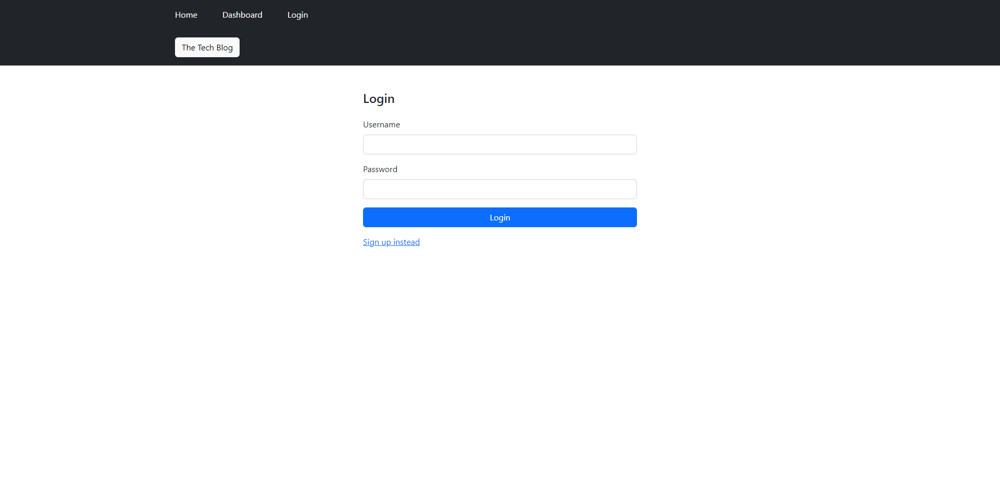

# Name
Jason's Model-View-Controller (MVC) Challenge: Tech Blog

## Description
 I attempted to create a CMS-style blog site similar to a Wordpress site, where developers can publish their blog posts and comment on other developers’ posts as well. Unfortunately, I was not able to fully complete this module. I was able to bring the blog to local host but when I went to create a login the server crashed. I uploaded to Heroku; however, the same error occurs.

  ## Screenshot of the blog on Heroku
" target= blank>Link to the screenshot</a>  
  
  ## Link to my repository
<a href="https://github.com/jrettinger/model-view-controller" target= blank>Link to my repository</a>

  ## Link to heroku
<a href="https://jasons-tech-blog.herokuapp.com/" target= blank>Link to my Heroku</a>

